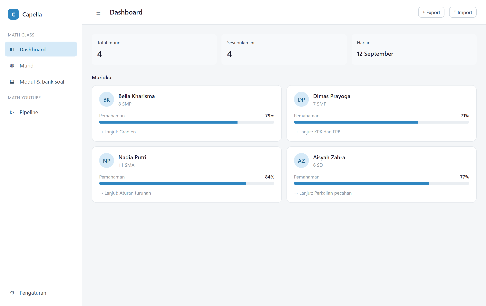
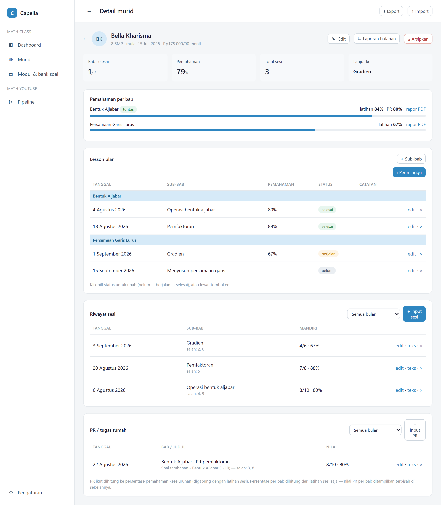
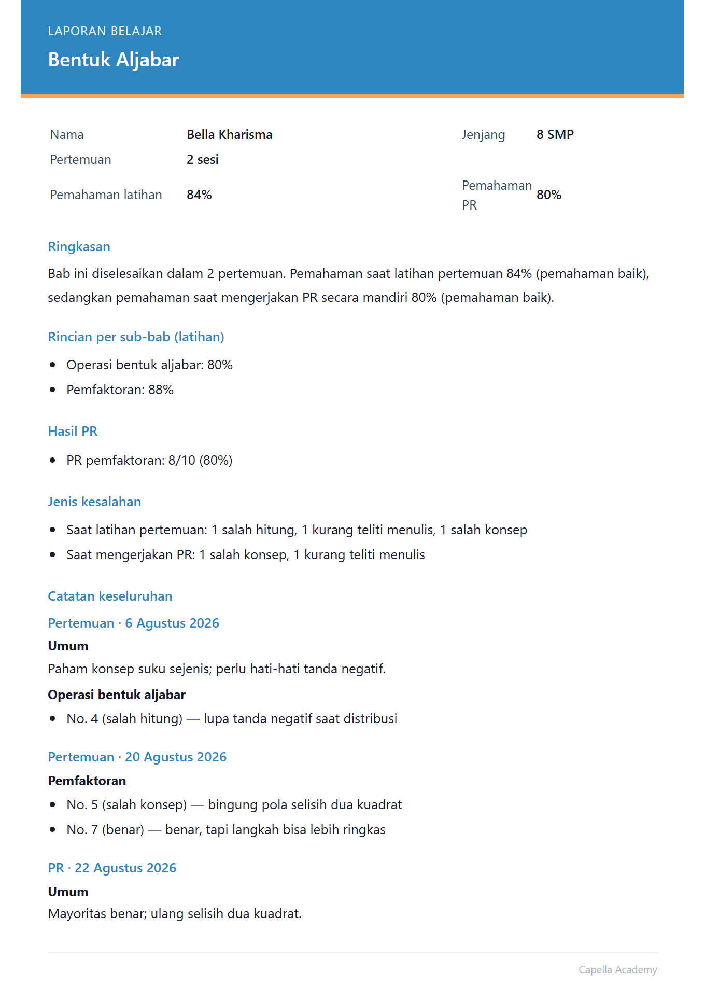
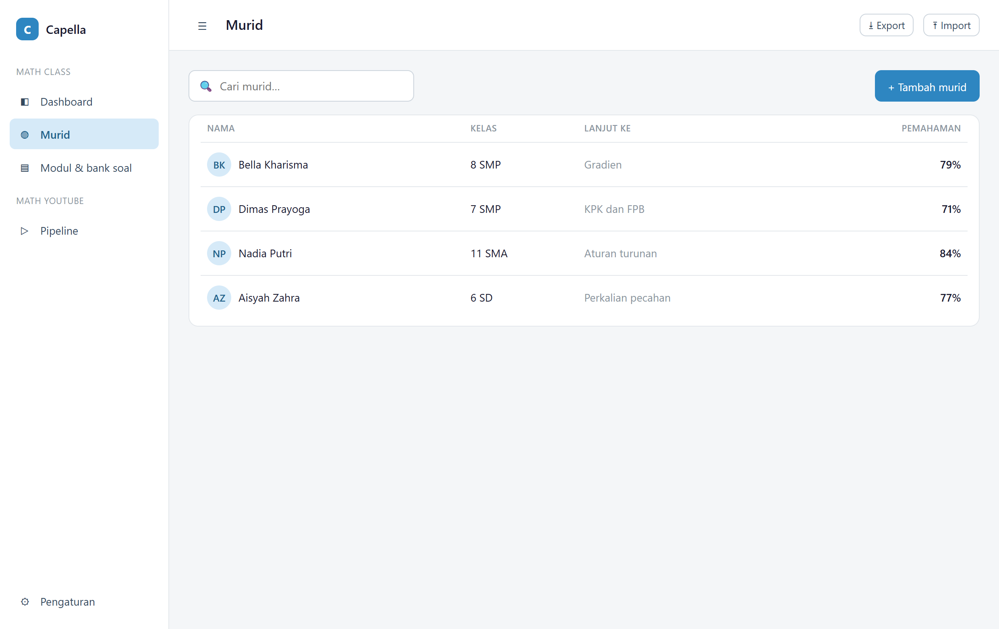

# Capella Academy — Student Progress Tracker

A single page web app for a small private tutoring practice to plan lessons, log
practice results, track comprehension per topic, and generate study and billing
reports. Built end to end: data model, scoring logic, report rendering, and UI.

> **Public demo.** All students, dates, and scores in this repository are
> **fictional sample data** generated for demonstration. No real student
> information is included. The production instance runs on a separate private
> Firebase project.



## What it does

Tutors record what a student worked on each session and which questions were
missed. From that raw log the app derives comprehension at every level and turns
it into reports that can be shared with parents.

- **Comprehension scoring** rolled up automatically from per-question results to
  sub-chapter, chapter, and overall percentages.
- **Per-number error tagging** (wrong concept, calculation slip, misread, etc.)
  so weak spots are visible, not just a score.
- **Lesson planning** with a weekly schedule and per sub-chapter status
  (not started, in progress, done).
- **Auto-generated study reports (PDF)** per chapter and per month, including a
  written summary, error-type breakdown, and per-session notes.
- **Monthly billing summary** computed from session count, duration, and tier
  rate, with prior-month overpayment carried forward.
- **Offline-first**: works fully on `localStorage`; optional Firebase sync and
  login when configured.

## Screenshots

| Student detail — comprehension analytics | Generated study report (PDF) |
|---|---|
|  |  |

Student list:



## Tech

- **Vanilla JavaScript** single-page app, no framework — hand-rolled router,
  views, and state layer (`js/data.js`, `js/views.js`, `js/modals.js`,
  `js/reports.js`).
- **Firebase** Realtime Database + Auth for optional cloud sync (disabled in
  this demo; see `js/firebase.js`).
- **html2pdf.js** for client-side PDF export of reports.

The UI language is Indonesian, matching the tutoring practice it was built for.

## Run locally

No build step. Serve the folder with any static server:

```bash
python -m http.server 8000
# then open http://127.0.0.1:8000
```

On first load the app seeds the fictional sample data (`js/demo-seed.js`) into
`localStorage`. Clear site data in DevTools to reset back to the sample set.

## Data & privacy

The sample data is invented. To run against real data you would paste your own
Firebase config into `js/firebase.js`; that keeps each deployment's data in its
own private project. This public repository contains code and sample data only.

---

Built by Vania Adisaputri · [github.com/Vaniaadisa24](https://github.com/Vaniaadisa24)
